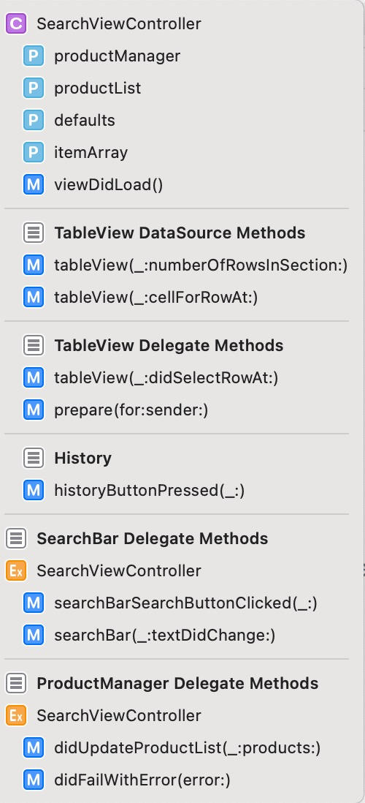

# Mercado Challenge

_Mercadolibre iOS Candidate - Challenge_


## Introducción al Challenge 🚀

_Con este ejercicio se busca que muestres conocimientos a la hora de crear un proyecto en
iOS y cómo planteas la solución. La respuesta a este ejercicio debe ser un link a Github,
Bitbucket o algún repositorio de código (público).
Mercado Libre posee APIs abiertas a la comunidad para que cualquier desarrollador las
consuma y pueda tener búsquedas y compras en su aplicación._

### Consignas 📋

_Desarrollar una app que utilice las APIs de Mercadolibre, con dos secciones:_

* Search: buscador de productos y listado de respuestas.
* Product Page: detalle de un producto (al cual se debería poder acceder al tappear
uno de los items en el resultado del search).

Los endpoints necesarios los encontrarás en:
[ItemsAndSearches](http://developers.mercadolibre.com/items-and-searches/)

(Si bien hay endpoints que necesitan un TOKEN, no son necesarios para realizar este
ejercicio)

La resolución del ejercicio es totalmente libre. Puedes entregar un listado y detalle de
productos que sea puro texto o un buscador con imágenes, iconos y texto, y un detalle
completo del producto, como el que se muestra en la web. La calidad y detalle de lo que
entregues será lo que evaluemos.


# Resolución 🔧

_Desarrollado con Swift 5.2 
Minimun platform iOS 10.0_

## Patrón de diseño ⚙️

_Model View Controller (MVC)._

### Model 📘

_Obtener y representar la información del producto._

* ProductModel
* ProductManager

#### Product Model

_Representa al producto junto con sus las propiedades._

#### Product Manager

_Interactúa con la API de Mercado Libre (Networking). 
Provee un delegate y protocol methods para ser implementados dentro del Controller._

```
protocol ProductManagerDelegate {
    func didUpdateProductList(_ productManager: ProductManager, products: [ProductModel])
    func didFailWithError(error: Error)
}
```

_Únicas propiedades accesibles:_
```
var delegate: ProductManagerDelegate?
```
* TableViewController que la utilice se va asignar a si mismo como delegate.

```
func fetchProduct(productName: String) { .... }
```
* Obtener la lista de productos.

### View 💻

_UI de la app._

* Storyboard
* ProductCell: Archivo **xib** para personalizar una UITableViewCell.

#### ProductCell

_Celda para representar las propiedades principales del producto (Imagen, título y precio). 
Consta de dos files:_

* ProductCell.swift
* ProductCell.xib

```
@IBOutlet weak var titleLabel: UILabel!
@IBOutlet weak var priceLabel: UILabel!
@IBOutlet weak var productImageView: UIImageView!
```

### Controller ⌨️

* SearchViewController 
* HistoryViewController
* ProductViewController 

#### Search View Controller

_Controlador del **Buscador de Productos y Listado de Respuestas**._

* _Interactúa con **ProductManager** para las tareas de Networking._
* _Se establecle como delegate de ProductManager._

```
productManager.delegate = self
```
* _E implementa el protocolo **ProductManagerDelegate** para poder llamar y establecer 
los métodos dentro de **ProductManager**._
```
extension SearchViewController: ProductManagerDelegate { .... }
```
* _Tiene **segues** hacia los otros View Controllers._

#### History View Controller

_Controlador del **Historial de Búsquedas** realizadas._

#### Product View Controller

_Controlador de la **Product Page** del producto seleccionado._

## Constants 🤝

_Struct que contiene todas las **key** como identifiers y segues._
_Objetivos:_
* _Evitar errores al escribir._
* _Practicidad, en caso de cambiar alguna de las key se hace en un solo lugar._

## Local Data Persistance 🔩

_Utiliza **UserDefaults** para guardar el historial de búsqueda, ya que es solo texto
y ocupa pocos KB._

## Pods utilizados 🛠️

_Para la instalación de los pods se utilizo **CocoaPods**._

* [Alamofire](https://github.com/Alamofire/Alamofire) 5.4.0 - HTTP Networking en Swift.
* [SwiftyJSON](https://github.com/SwiftyJSON/SwiftyJSON) 5.0.0 - Lidiar con JSON data en Swift.
* [SDWebImage](https://github.com/SDWebImage/SDWebImage) 5.10.0 - Extraer imagen de URL.

## //MARK: -

_Para una mejor lectura el codigo esta marcado por secciones._



## Autor ✒️

_Jonatan Gabriel Garcia._

## Gratitud 🎁

* Agradezco a **Paulo** _Project Leader Mobile de Mercado Libre_ por esta oportunidad. 🍺
